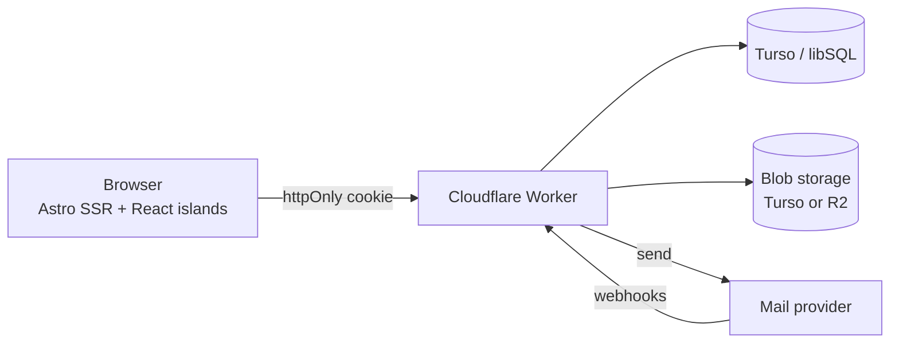
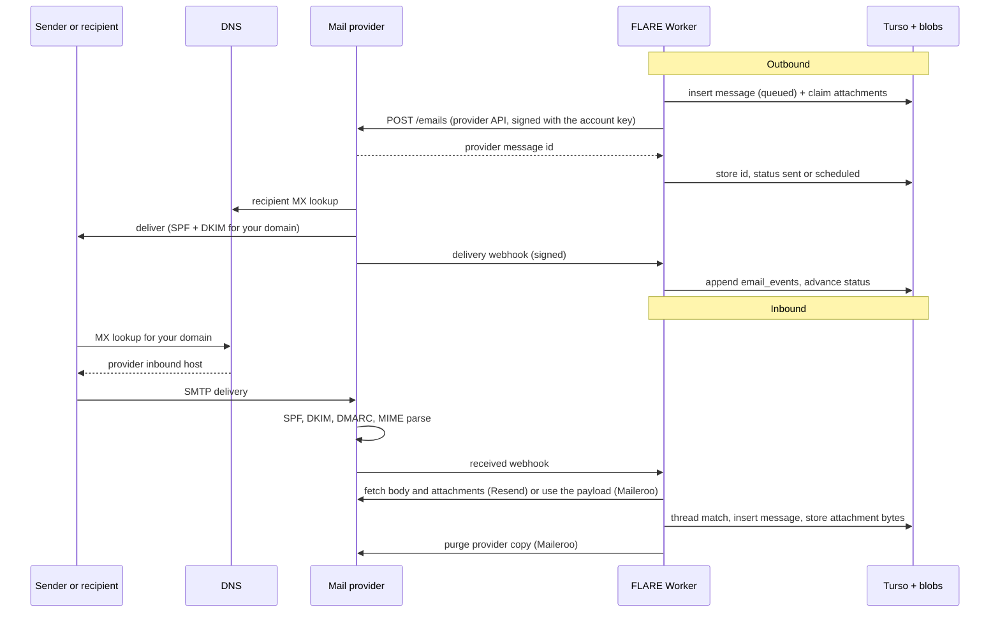

<p align="center">
  
</p>

<p align="center">
  
  
  
  
</p>

FLARE is a self-hosted webmail client for your own domain. Send through Resend or Maileroo,
receive through their inbound webhooks, keep everything in a Turso database, and serve it from a
single Cloudflare Worker. No IMAP bridge, no mailbox quota, no third party reading your mail.

It is built for the single-owner case: a handful of accounts, one login, a UI that behaves like a
real mail client. The whole thing deploys as one Worker with a static asset bundle, and it also
runs comfortably on a laptop with no Cloudflare account at all.

## Features

**Mail**

- Send with attachments and reply threading. The message is written before the provider call, so
  it appears in Sent instantly and flips to `failed` with a reason if the provider rejects it.
- Schedule a send from the composer and cancel it from the conversation before it leaves.
- Receive through a signature-verified webhook. Bodies come from the provider API, attachment
  bytes are copied into your own storage, and threading follows `In-Reply-To`, `References`, or a
  subject plus participant match.
- Track delivery per message: `queued → sent → delivered → opened → clicked`, with bounced,
  complained, failed and canceled as terminal states. The status only moves forward.
- Pull the recent picture on demand, or let it run by itself: a silent sync fires on load, every
  minute while the tab is visible, and when the window regains focus.

**Accounts and identity**

- Run several mail accounts side by side and switch between them from the sidebar. Each account
  has its own provider, From address, domain and credentials, and its own data.
- Profile with a display name (used in the `From` header) and a picture, uploaded or set from a
  URL.

**Interface**

- Three-pane layout with resizable panels, a command palette, and keyboard shortcuts throughout.
- Four palettes in light and dark mode: Proton (default), Zinc, Nord and Rosé. Message bodies
  follow the palette.
- Single-pane mobile flow with a drawer, and a deep-linkable `/thread/[id]` page.

**Operations**

- Provider tools in Settings: webhook registration with the signing secret, suppression list
  management, and 7-day deliverability metrics.
- Blob storage is pluggable. The default keeps attachment bytes in Turso, so R2 is optional.
- One-command migrations, admin bootstrap and demo seeding.

## Screenshots

Light and dark are both first class. This is the three-pane layout with a conversation open in the
light palette, including the per-message delivery timeline:

<p align="center">
  
</p>

The same views in Proton, the default dark palette:

<table align="center">
  <tr>
    <td align="center" width="50%"></td>
    <td align="center" width="50%"></td>
  </tr>
  <tr>
    <td align="center" width="50%"></td>
    <td align="center" width="50%"></td>
  </tr>
</table>

Below `md` the layout collapses to a single pane with a drawer:

<table align="center">
  <tr>
    <td align="center" width="50%"></td>
    <td align="center" width="50%"></td>
  </tr>
</table>

## Architecture



The Worker has two halves. Astro server-renders every page behind session middleware, then a React
island (`MailClient`) takes over selection, compose, search and shortcuts. API routes live under
`src/pages/api` and read Turso through `@libsql/client/web`.

Inbound mail is push plus pull. The push path is a webhook: the provider posts JSON, the handler
verifies the signature, fetches the body, copies attachments into blob storage, and inserts the
thread. The pull path is the sync service, which lists recent received email and refreshes
outbound statuses; it backs both the Sync button and the one-minute background pull.

Status updates append to `email_events` and move `messages.status` forward only. Opening a thread
clears its unread count, and folder badges come from one grouped query.

## How mail connects

FLARE never speaks SMTP. It talks to a provider's HTTP API, and the provider owns the MX record and
the sending reputation. That split is why the app can run on Workers at all, and it is worth
understanding before changing DNS.



### DNS is the connection

Sending and receiving need different records. Sending works as soon as SPF and DKIM verify; receiving
only works once MX points at the provider.

| Record | Purpose | Needed for |
| --- | --- | --- |
| `MX` | Tells the world where to deliver mail for your domain | Receiving |
| `TXT` SPF | Authorizes the provider's servers to send as your domain | Sending |
| `TXT` DKIM | Publishes the key the provider signs with, so receivers can verify | Sending |
| `TXT` DMARC | Tells receivers what to do with mail that fails SPF and DKIM | Reputation |
| `CNAME` tracking | Open and click tracking subdomain, optional | Status events |

A subdomain (`mail.example.com`) is the better choice: it keeps the root domain's mail and
reputation untouched, and it makes the split obvious when you read the records. Verify the domain in
the provider dashboard, publish exactly what it shows, and wait for the status to read verified
before pointing a webhook at the app. Settings mirrors that health check inside the app.

### Outbound, step by step

1. The composer posts to `/api/messages/send`. Recipients and attachments are validated first.
2. A `messages` row is written with status `queued` (or `scheduled` when a delivery time was
   chosen) and draft attachments are claimed. This happens before the provider call so the UI can
   show the message instantly.
3. The provider adapter sends it: Resend through its SDK to `api.resend.com`, Maileroo to
   `smtp.maileroo.com/api/v2/emails` with an `X-Api-Key` header. Reply headers carry
   `In-Reply-To` and `References` so the recipient's client threads it.
4. The provider signs with your domain's DKIM key, looks up the recipient's MX, and delivers.
5. Delivery events come back as webhooks. Each one is appended to `email_events`, and
   `messages.status` only ever moves forward: `queued → sent → delivered → opened → clicked`, with
   `bounced`, `complained`, `failed` and `canceled` terminal.
6. If a webhook never arrives, the sync path asks the provider for the current state instead
   (`emails.get` on Resend, webhooks only on Maileroo). That is the same code the Sync button and
   the minute timer run.

### Inbound, step by step

1. Someone sends mail to your domain. Their server looks up MX, which points at the provider.
2. The provider accepts the SMTP connection, checks SPF, DKIM and DMARC, parses the MIME, and
   stores the body and attachments.
3. It notifies the app. Resend posts a signed `email.received` with only metadata; Maileroo posts
   the whole message and asks you to confirm authenticity by calling a one-time `validation_url`.
4. The handler verifies before touching the database. A bad signature is a 400 and nothing is
   written; an ingest failure is a 500 so the provider retries, and the insert is idempotent per
   provider message id.
5. The body is fetched (Resend Receiving API with `html_format=cid`) or read from the payload
   (Maileroo), and attachment bytes are copied into blob storage while the signed URLs are valid.
   Resend's download URLs expire after an hour; Maileroo keeps its copy for 72 hours and exposes a
   `deletion_url` that the app calls once everything is stored.
6. Threading resolves in order: `In-Reply-To`, then `References`, then a normalized subject plus a
   shared participant, and finally a new thread. That fallback is what keeps mail from a client
   that never sends proper headers in one place.
7. The message lands with `status = received`, the thread's unread count and participants update,
   `cid:` image references are rewritten to authenticated attachment URLs, and the folder badges
   pick it up from the next query.

### What each provider gives the app

| Concept | Resend | Maileroo |
| --- | --- | --- |
| Send | `POST /emails` through the SDK | `POST /api/v2/emails` with `X-Api-Key` |
| Delivery webhook auth | Svix signature, `whsec_` secret | HMAC-SHA256 hex in `x-maileroo-signature` |
| Inbound model | Metadata webhook, then fetch content | Full message in the webhook |
| Inbound auth | Svix signature | One-time `validation_url` |
| Attachments | API returns signed URLs, valid 1 hour | Signed URLs in the payload, 72 hour retention |
| Status lookup | `emails.get` reports `last_event` | Webhooks only |
| Scheduling | `scheduledAt`, cancel by id | `scheduled_at`, list and delete |
| Management API | Domains, webhooks, suppressions, metrics | Account API with scopes, plus statistics |

### Where state lives

| Concern | Stored in | Why |
| --- | --- | --- |
| Threads and messages | Turso | Small rows, queried constantly, must be consistent |
| Delivery history | `email_events` | Append-only audit, drives the status timeline |
| Attachment bytes | `blobs` (default) or R2 | Large binaries, kept out of the message rows |
| Uploaded avatars | Same blob store | One code path for every binary |
| Sessions | Turso | Server-side revocation, hashed tokens only |
| Active account | Cookie | Per browser, no server state to clean up |

## Quick start

You need Node 20+ and pnpm. The Turso CLI is only needed if you want a local database instead of a
hosted one. A provider API key is only needed to send.

```bash
pnpm install

# Local libSQL server (no Turso account required)
PATH="$HOME/.turso:$PATH" turso dev -f local.db -p 8080 &

cp .dev.vars.example .dev.vars   # set SESSION_SECRET and your provider key
pnpm migrate
pnpm create-admin            # credentials come from FLARE_ADMIN_* in .env
pnpm dev
```

`pnpm dev` runs Astro on workerd, so bindings, vars and secrets behave the same as in production.
The dev server is a daemon and the scripts wrap its lifecycle: `pnpm dev:status`, `pnpm dev:logs`,
`pnpm dev:stop`, or `pnpm dev -- --force` to replace a running instance.

The CLI scripts read `.dev.vars` first and fall back to `.env`. Only `.dev.vars` is read by the
Worker runtime during `pnpm dev`. `.env.example` is the complete credential reference: copy it to
`.env`, fill in the mailbox login and your provider keys, and `pnpm create-admin` with no arguments
will seed that login. `.npmrc` sets a 24 hour minimum release age, so installs skip
packages published in the last day; that keeps local lockfile verification in agreement with CI.

To explore the UI with fictional data:

```bash
pnpm seed-demo          # refuses a remote turso.io database unless --force is passed
```

| Command | What it does |
| --- | --- |
| `pnpm dev` / `pnpm dev:stop` / `pnpm dev:status` / `pnpm dev:logs` | Dev server lifecycle |
| `pnpm build` / `pnpm preview` | Production build, then the built Worker on workerd |
| `pnpm typecheck` | `astro check` across `.astro` and TS/TSX |
| `pnpm types` | `wrangler types` → regenerates `worker-configuration.d.ts` (committed) |
| `pnpm migrate` | Applies `migrations/*.sql` once each |
| `pnpm create-admin <email> <password> ["Display Name"]` | Creates or updates the user, revoking old sessions |
| `pnpm seed-demo` | Fictional threads for UI work |
| `pnpm deploy` | `wrangler deploy` |

## Mail providers

Everything mail-related goes through one interface in `src/lib/providers`: sending, receiving,
attachment fetch, delivery status, signature verification, domains, webhooks, suppressions and
metrics. `MAIL_PROVIDER` picks the default backend and each account picks its own.

### Resend

1. Add your domain (a subdomain like `mail.example.com` keeps your root domain's mail separate)
   and publish the DNS records Resend shows.
2. Enable receiving for the domain and publish the MX record it gives you.
3. Create an API key with sending access, and a webhook pointing at
   `https://<your-app>/api/webhooks/resend/<account-id>` subscribed to: `email.received`,
   `email.sent`, `email.scheduled`, `email.delivered`, `email.delivery_delayed`,
   `email.bounced`, `email.complained`, `email.opened`, `email.clicked`.
4. Store the webhook's signing secret as `RESEND_WEBHOOK_SECRET`.

The secret starts with `whsec_` and the rest is base64. A made-up value is the fastest way to get
`Invalid webhook signature` on every request.

### Maileroo

- Send posts to `https://smtp.maileroo.com/api/v2/emails` with an `X-Api-Key` header. Scheduling
  uses `scheduled_at`, and the app can list and delete scheduled email.
- Delivery webhooks are signed with HMAC-SHA256 over the raw body in `x-maileroo-signature`.
  Events map onto the same status vocabulary: `accepted → sent`, `deferred → delivery_delayed`,
  `failed → bounced`, `rejected → failed`.
- Inbound routing posts the whole message, so the handler parses it directly, validates the
  one-time `validation_url`, downloads attachments from the signed URLs, then calls
  `deletion_url` to purge Maileroo's copy.
- The Account API (`https://api.maileroo.com/v1`, Bearer auth) backs the Settings tools: webhooks,
  suppressions and statistics. The key needs the matching scopes (`webhooks.read`,
  `suppressions.read`, `statistics.read`, `domains.read`).

Set `MAILEROO_API_KEY` and `MAILEROO_WEBHOOK_SECRET`, point an inbound route at
`https://<your-app>/api/webhooks/maileroo/<account-id>`, and add an account entry as shown below.

### SMTP

Any relay can be a send-only account: add it in Settings with host, port, TLS mode, username and
password. Resend and Maileroo both offer SMTP on port 465, which is the mode to use when you have
the choice; the `starttls` option depends on the runtime performing the TLS upgrade at connect
time and some servers reject that. Workers cannot listen for inbound SMTP, so an SMTP account only
sends. Receiving keeps happening through whichever account owns the domain's MX record.

### Adding a provider

Implement `MailProvider` from `src/lib/providers/types.ts` and add a case to
`src/lib/providers/index.ts`. The optional members (`classifyWebhook`, `parseInbound`,
`finalizeInbound`, `cancelScheduled`, `listScheduled`, `addSuppression`) are how a provider
declares what its API can do; the UI degrades gracefully when one is missing.

## Accounts

There are two ways to define a mail account, and they mix freely.

**From Settings** is the quick path: pick Resend, Maileroo or SMTP, fill in the From address and the
credentials, and it becomes the active account. Secrets are encrypted with AES-GCM under a key
derived from `SESSION_SECRET` before they reach Turso, so provider keys never sit in the database in
clear text. Accounts created this way can be removed from the same card.

**From the environment** suits infrastructure as code. `MAIL_ACCOUNTS` in `wrangler.jsonc` is a JSON
array where every entry names its credentials by environment variable:

```json
[
  {
    "id": "personal",
    "provider": "resend",
    "label": "Personal",
    "fromEmail": "me@example.com",
    "fromName": "Me",
    "inboundDomain": "example.com",
    "apiKeyEnv": "RESEND_API_KEY",
    "webhookSecretEnv": "RESEND_WEBHOOK_SECRET"
  }
]
```

`wrangler.jsonc` takes JSON, so the value has to be that array as a single string:

```bash
node -e "console.log(JSON.stringify(require('./accounts.json')))"
```

One rule ties both together: the environment account is always present as `primary` unless a
database row claims that id. Existing mail therefore never disappears when you start adding
accounts. Threads and messages carry `account_id`, the active account lives in a cookie and is
switched from the sidebar, the mobile drawer or the account card, and every account has its own
webhook endpoint so signatures verify with the right secret.

An account's provider decides what it can do. Resend and Maileroo send and receive; SMTP only
sends; each provider reports the APIs it does not have instead of failing silently.

## Profile

Settings has a profile card: a display name used in the `From` header and a picture that can be
uploaded (stored through the blob store) or set from a direct image URL. An upload replaces the
URL, and Remove clears both.

The display name and account `fromName` decide the From header in this order:
`account.fromName`, then the profile display name, then `MAIL_FROM_NAME`.

## Configuration

Non-secret values live in `wrangler.jsonc` under `vars`:

| Name | Example | Notes |
| --- | --- | --- |
| `RESEND_INBOUND_DOMAIN` | `example.com` | Verified sending/receiving domain for the primary account |
| `MAIL_FROM_NAME` | `FLARE` | Fallback From display name |
| `PUBLIC_APP_URL` | `https://flare.example.com` | Used for the webhook URL shown in Settings |
| `MAIL_PROVIDER` | `resend` | Backend for the synthesised account (`resend` or `maileroo`) |
| `MAIL_ACCOUNTS` | *(empty)* | JSON array of accounts, see above |
| `BLOB_STORE` | `database` | Attachment storage: `database` (default, no R2), `r2` or `auto` |

### Where credentials live

| File | Read by | Holds |
| --- | --- | --- |
| `.env` | CLI scripts (`migrate`, `create-admin`, `seed-demo`) | Mailbox login, Turso, provider keys |
| `.dev.vars` | Worker runtime during `pnpm dev` | Provider keys, Turso, session secret |
| Wrangler secrets | Deployed Worker | The same values as `.dev.vars` |

The mailbox login comes from `FLARE_ADMIN_EMAIL`, `FLARE_ADMIN_PASSWORD` and `FLARE_ADMIN_NAME`.
`pnpm create-admin` uses command line arguments when you pass them and those variables otherwise.
Only the PBKDF2 hash reaches Turso; the Worker never reads the password.

Provider accounts name their credentials by environment variable (`apiKeyEnv`,
`webhookSecretEnv`), so the same file works for Resend, Maileroo, or both. SMTP relay credentials
are not read by FLARE, which uses provider HTTP APIs; `.env.example` documents them for use with
other mail clients.

Secrets go in `.dev.vars` locally and through `wrangler secret put` in production:

| Name | Where it comes from |
| --- | --- |
| `RESEND_API_KEY` | Resend, with sending access |
| `RESEND_WEBHOOK_SECRET` | The webhook detail page |
| `MAILEROO_API_KEY` | Maileroo sending key |
| `MAILEROO_WEBHOOK_SECRET` | Maileroo webhook shared secret |
| `TURSO_DATABASE_URL` | `libsql://…` from `turso db show` |
| `TURSO_AUTH_TOKEN` | `turso db tokens create` |
| `SESSION_SECRET` | `openssl rand -base64 48` |

### Storage: R2 is optional

Attachments are binary blobs, so they do not belong in the message rows. By default FLARE keeps
them in a `blobs` table in Turso, which means the app runs with no object storage at all. If you
have R2 enabled, add the binding back to `wrangler.jsonc` and set `BLOB_STORE` to `r2` (or `auto`
to prefer the binding when it exists).

## Deployment

The repository ships two workflows: `ci.yml` runs typecheck and build on branches,
`deploy.yml` runs the same checks and deploys on every push to `main`.

**Before the first deploy, enable R2 in the Cloudflare dashboard if you plan to use it.** The
default database store does not need it; a Worker with an R2 binding does, and creating a bucket
without R2 enabled returns `code: 10042`.

```bash
# 1. Push the repo, then create an API token with:
#      Account > Workers Scripts > Edit
#      Account > Workers R2 Storage > Edit   (only if you use R2)
gh secret set CLOUDFLARE_API_TOKEN
gh secret set CLOUDFLARE_ACCOUNT_ID

# 2. App secrets are set once and survive deploys
wrangler secret put RESEND_API_KEY
wrangler secret put RESEND_WEBHOOK_SECRET
wrangler secret put TURSO_DATABASE_URL
wrangler secret put TURSO_AUTH_TOKEN
wrangler secret put SESSION_SECRET

# 3. Data, then deploy
TURSO_DATABASE_URL="libsql://…" TURSO_AUTH_TOKEN="…" pnpm migrate
TURSO_DATABASE_URL="libsql://…" TURSO_AUTH_TOKEN="…" pnpm create-admin you@example.com "…"
pnpm deploy
```

Attach your domain to the Worker (Settings, Domains & Routes), update `PUBLIC_APP_URL`, then
register the webhook against the final URL. The Settings page has a button that registers it for
you and shows the signing secret to store. Cloudflare's own Git integration works too: build
`pnpm build`, deploy `pnpm exec wrangler deploy`.

## API

Every route below requires a session except the webhook, which authenticates by signature.

| Method | Path | Purpose |
| --- | --- | --- |
| POST | `/api/auth/login` | Email + password, sets the session cookie (10 attempts / 15 min / IP) |
| POST | `/api/auth/logout` | Clears the session |
| GET | `/api/auth/session` | Current user, or 401 |
| GET/PATCH | `/api/profile` | Read or update the display name and avatar URL |
| GET/POST/DELETE | `/api/profile/avatar` | Read, upload or clear the picture |
| GET/POST | `/api/accounts` | List accounts, switch the active one |
| GET | `/api/threads?folder=inbox\|sent\|archive\|trash\|all&q=&cursor=` | Thread list plus folder counts |
| GET | `/api/threads/:id` | Thread, messages, attachments, event timelines (marks read) |
| PATCH | `/api/threads/:id` | Move to another folder |
| DELETE | `/api/threads/:id` | Delete the thread and its blobs |
| POST | `/api/messages/send` | Send, reply, or schedule |
| POST | `/api/messages/:id/read` | `{"read": true\|false}` |
| POST | `/api/messages/:id/cancel` | Cancel a scheduled send |
| POST | `/api/attachments/upload` | Multipart upload into blob storage |
| GET | `/api/attachments/:id` | Auth-gated stream, `?inline=1` for inline parts |
| POST | `/api/sync` | Import recent received mail and refresh outbound statuses |
| GET/POST/DELETE | `/api/provider/suppressions` | List, add and remove suppressions |
| GET/POST/DELETE | `/api/provider/webhooks` | List, register and delete webhooks |
| POST | `/api/webhooks/<provider>/<accountId>` | Provider events, signature verified |

## Data model

Seven tables, all in `migrations/`. `threads` groups `messages` per account; `attachments` point
at storage keys; `email_events` is the append-only delivery log; `blobs` holds bytes when the
database store is used; `users` and `sessions` handle auth.

Decisions worth knowing about:

- `attachments.message_id` is nullable on purpose: outbound files are uploaded before the message
  exists and get claimed by the send handler.
- Timestamps are written from JavaScript as ISO strings, not SQLite's `datetime('now')`. Mixing
  the two formats breaks lexicographic ordering.
- libSQL over HTTP has no interactive transactions, so multi-statement writes use
  `client.batch(..., 'write')`.
- Foreign keys are not enforced over HTTP, so deletes are explicit.
- A reply keeps its thread's folder. Replying to an inbox thread does not also file it under Sent;
  Sent lists threads started from compose.
- Scheduled messages are claimed by the `scheduled` status until a webhook or a cancel moves them.

## Security

- Passwords: PBKDF2-SHA256, 210,000 iterations, 16-byte salt, constant-time compare. No sign-up
  page; the user is created from the CLI.
- Sessions: the cookie is `token.HMAC(SESSION_SECRET, token)` and the database stores only
  `sha256(token)`, so a database dump cannot be replayed. `HttpOnly`, `Secure`, `SameSite=Lax`,
  30-day sliding expiry, revoked on password change.
- Webhooks verify the raw body before touching the database and return 400 on a bad signature.
  Inbound failures return 500 so the provider retries; handlers are idempotent per provider id.
- Message HTML renders in a sandboxed iframe without `allow-scripts`, so mail cannot run
  JavaScript in the app. Remote images load like they would in any client.
- Attachment and avatar downloads go through an auth check. Storage keys are never public.
- State-changing endpoints are JSON only and sessions are `SameSite=Lax`, which is why Astro's
  origin check is off: providers post webhooks cross-site.
- Login rate limiting is in-memory per isolate. Fine for one owner; put Cloudflare Access in front
  of the Worker if you want a second gate.

## Keyboard shortcuts

| Key | Action |
| --- | --- |
| `c` | Compose |
| `r` | Reply |
| `e` | Archive, or move back to inbox |
| `#` | Trash |
| `j` / `k` | Move focus in the thread list |
| `Enter` | Open the focused thread |
| `/` | Focus search |
| `⌘K` / `Ctrl+K` | Command palette |
| `⌘↵` | Send from compose |

Shortcuts stay out of the way while you type in an input, textarea or contenteditable.

## Project layout

```
src/
  middleware.ts              session gate for everything except /login and webhooks
  layouts/AppShell.astro     html shell, theme bootstrap, toaster
  pages/                     login, folders, thread/[id], settings
  pages/api/                 auth, profile, accounts, threads, messages, attachments, sync, provider, webhooks
  components/ui/             shadcn primitives
  components/mail/           MailClient island and its parts
  components/settings/       profile, provider tools, actions
  lib/                       db, auth, accounts, profile, providers, storage, mail, sync, helpers
migrations/                  SQL applied by pnpm migrate
scripts/                     migrate, create-admin, seed-demo
.github/workflows/           ci.yml and deploy.yml
docs/                        logo and screenshots
```

## Troubleshooting

**`Invalid webhook signature` on every event.** The secret is wrong, or the body was parsed before
verification. Paste the exact value; for Resend it must be base64 after `whsec_`.

**No inbound mail.** `/settings` shows the active account's domain and webhook health. For Resend,
the domain must be verified with receiving enabled and the webhook registered. For Maileroo, the
inbound route must point at `/api/webhooks/maileroo/<account-id>`.

**Scheduled cancel fails with "Email is not scheduled".** Resend accepts the send slightly before
it flips the message into the scheduled state. The provider retries that specific error a few
times; if it still fails, the message has not settled yet.

**SMTP send fails against port 587.** STARTTLS depends on the runtime upgrading the socket at
connect time, which not every server accepts. Use implicit TLS on 465.

**An SMTP account has no inbox.** That is expected. SMTP can only send; inbound mail arrives
through the account whose domain MX points at a provider with a receiving webhook.

**Webhooks during local development.** Providers cannot reach localhost. Tunnel it
(`cloudflared tunnel --url http://localhost:8787`), then either register a second dev webhook or
use the Settings button and store the returned signing secret in `.dev.vars`.

**`code: 10042` when deploying.** R2 is not enabled but a binding is declared. Enable R2 or switch
`BLOB_STORE` to `database` and remove the binding.

**Types drift after editing `wrangler.jsonc`.** Run `pnpm types`.

## Limits

Single admin user by design, with multiple mail accounts. Message bodies are kept forever; there
is no retention job yet. Search covers the selected folder in the list and all folders from the
palette. Templates, broadcasts, automations and dedicated IPs from the provider APIs are
intentionally not surfaced, they are marketing features rather than webmail. There is no IMAP or
SMTP bridge, so FLARE cannot be used from Apple Mail or Thunderbird.

## License

MIT. See [LICENSE](LICENSE) for the full text.
