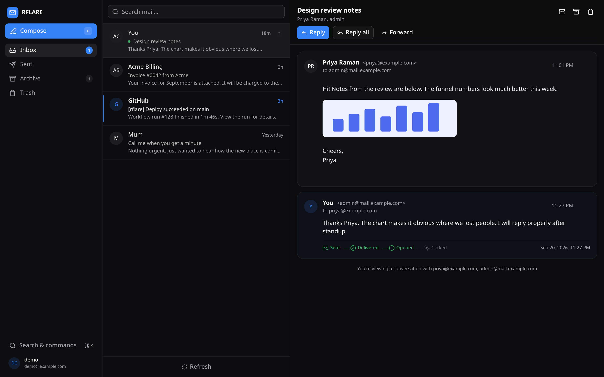
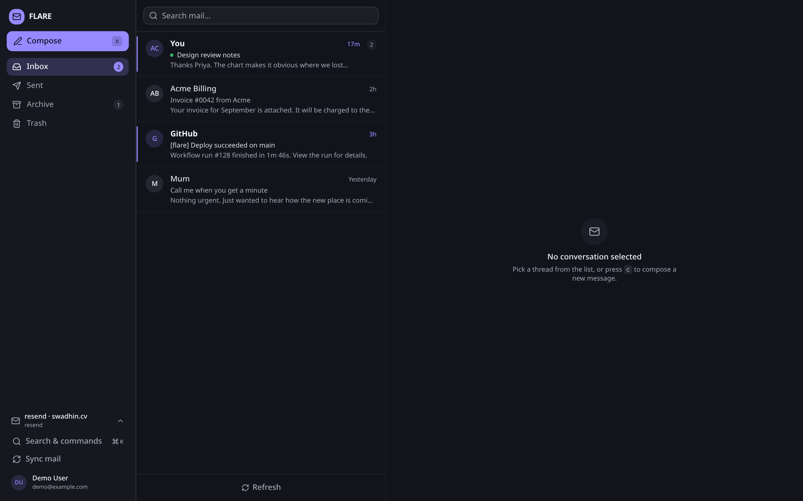
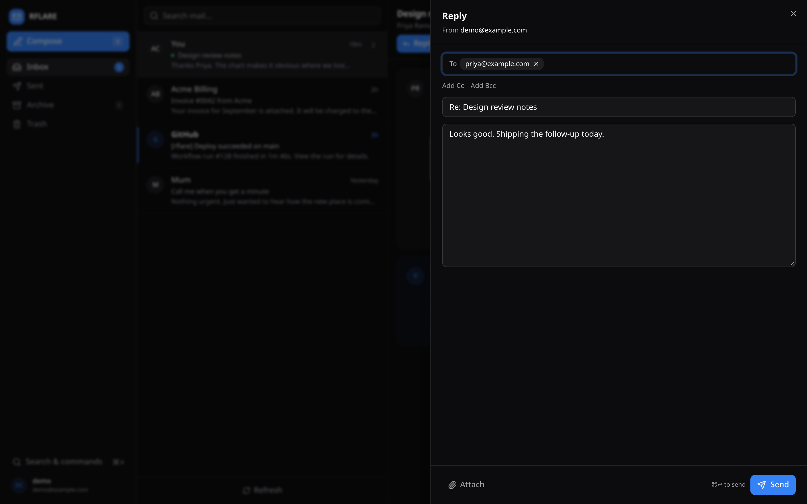
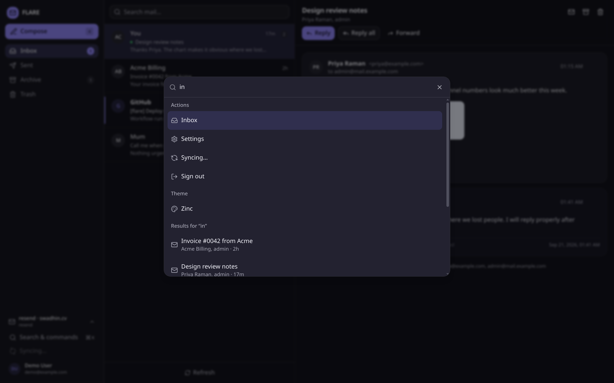
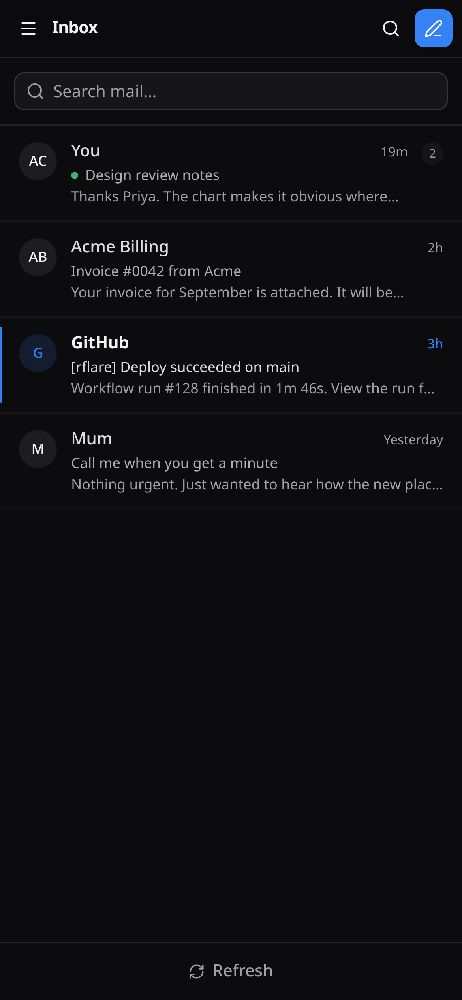
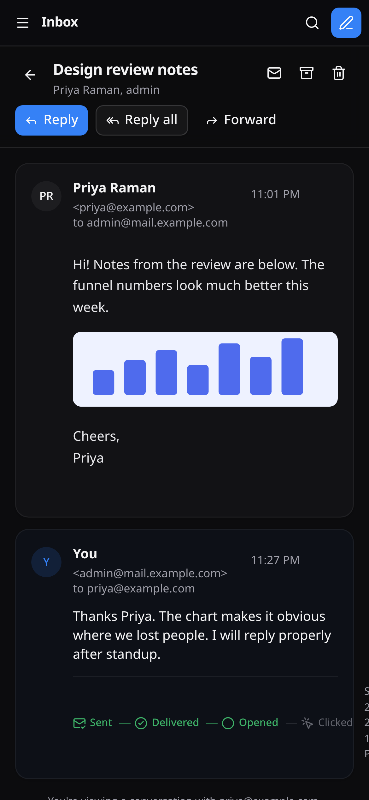
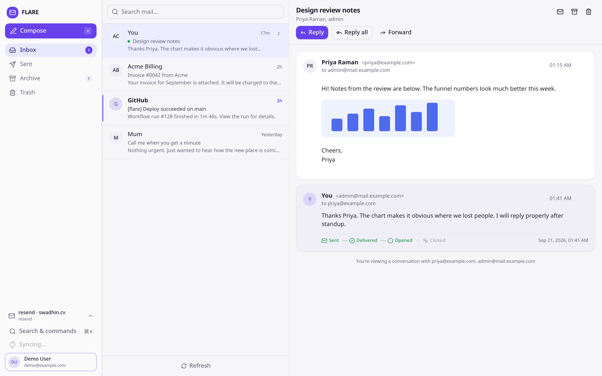
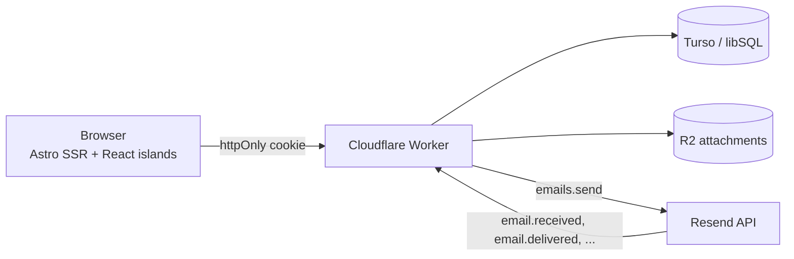
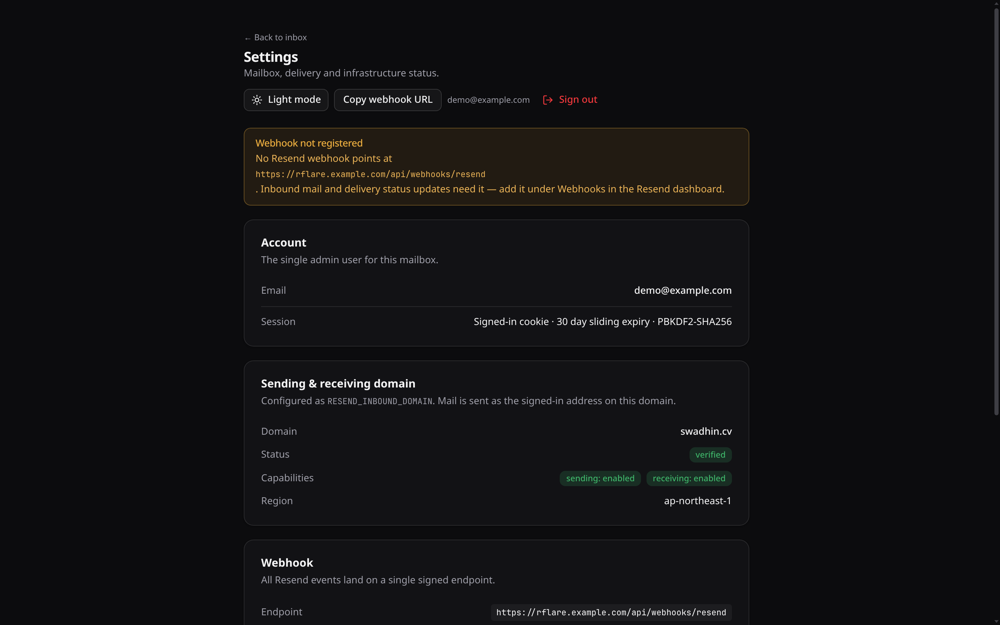

<p align="center">
  
</p>

<p align="center">
  
  
  
  
</p>

RFLARE is a webmail client you run yourself, for one domain. Send through Resend, receive
through Resend's inbound webhooks, keep everything in a Turso database, and serve it all from
a single Cloudflare Worker. No IMAP bridge, no mailbox quota, no third party reading your mail.

It is built for the single-owner case: one login, one domain, a UI that behaves like a real
mail client. The whole thing deploys as one Worker with a static asset bundle.

## Screenshots

<table>
  <tr>
    <td width="62%"></td>
    <td width="38%"></td>
  </tr>
  <tr>
    <td></td>
    <td></td>
  </tr>
  <tr>
    <td></td>
    <td></td>
  </tr>
</table>

Light theme is one click away in the account menu, and delivery status is visible per message:



## What it does

- **Send** with attachments and reply threading. The message row is written before the API call,
  so it shows up in Sent immediately and flips to `failed` with a reason if Resend rejects it.
- **Receive** through a signed webhook. The handler pulls the body and attachments from the
  Receiving API, copies attachment bytes into R2, and threads the message by `In-Reply-To`,
  `References`, or a subject + participant match.
- **Track delivery** per message: `queued → sent → delivered → opened → clicked`, with bounced,
  complained and failed as terminal states. The status only moves forward, so a late webhook can
  never walk a delivered message back to sent.
- **Sync from Resend** pulls the recent picture on demand: received emails that predate the
  webhook are imported and outbound statuses refresh from the API.
- **Search** the current folder from the list, or everything from `⌘K`.
- **Keyboard-first**: `c`, `r`, `e`, `#`, `j`/`k`, `Enter`, `/`, `⌘K`, `⌘↵`.

## How it works



The Worker has two halves. Astro server-renders each page behind session middleware, then a
React island (`MailClient`) takes over for selection, compose, search and shortcuts. The API
routes are plain Astro endpoints under `src/pages/api`, all of them reading from Turso through
`@libsql/client/web`.

Inbound mail arrives as a webhook, not as SMTP. Resend parses the message and posts JSON, so
the handler fetches the body separately and drops attachment bytes into R2 before inserting
anything. That keeps the database small and means an inbound attachment survives even though
Resend's download URLs expire after an hour.

Status updates append to `email_events` and move `messages.status` forward only. Opening a
thread clears its unread count; the folder badges come from a single grouped query.

## Quick start (local)

You need Node 20+, pnpm, and the Turso CLI for a local database. A Resend API key is only
required if you want to actually send. `.npmrc` sets a 24 hour minimum release age, so installs
skip packages published in the last day; that keeps local lockfile verification in agreement
with CI.

```bash
pnpm install

# Local libSQL server (no Turso account needed)
PATH="$HOME/.turso:$PATH" turso dev -f local.db -p 8080 &

cp .dev.vars.example .dev.vars   # then set SESSION_SECRET and, if you have one, RESEND_API_KEY
pnpm migrate
pnpm create-admin you@mail.example.com "a-long-password"
pnpm dev
```

`pnpm dev` runs Astro on workerd, so R2 bindings, vars and secrets behave the same as in
production. The dev server is a daemon: `pnpm exec astro dev status`, `... logs`, `... stop`.

The scripts read `.dev.vars` first and fall back to `.env`, so either file works for
`pnpm migrate`, `pnpm create-admin` and `pnpm seed-demo`. Only `.dev.vars` is read by the Worker
runtime during `astro dev`.

To try the UI without a real mailbox, seed fictional threads:

```bash
pnpm seed-demo
```

## Resend setup

1. Add your domain (or a subdomain like `mail.example.com`; a subdomain keeps your root domain's
   mail separate) in the Resend dashboard and publish the DNS records it shows.
2. Open the domain's settings and enable receiving. Resend will show an MX record for it.
3. After the domain reads as verified, create a webhook pointing at
   `https://<your-app>/api/webhooks/resend` and subscribe it to:
   `email.received`, `email.sent`, `email.delivered`, `email.delivery_delayed`,
   `email.bounced`, `email.complained`, `email.opened`, `email.clicked`.
4. Copy the webhook's signing secret into `RESEND_WEBHOOK_SECRET`.

The secret starts with `whsec_` and the rest is base64. Pasting a made-up value is the fastest
way to get `Invalid webhook signature` on every request.

`/settings` in the app checks the domain and webhook against the Resend API and warns you when
something is missing:



Resend never replays history, so mail that arrived before the webhook existed will not show up on
its own. **Sync from Resend** (folder rail, mobile drawer, or `⌘K`) imports the 25 most recent
received emails and refreshes outbound statuses. It calls `POST /api/sync`, which is auth-gated
and accepts an optional `limit` up to 100. Until the webhook is live, that button is also how you
pull in new mail.

## Configuration

Non-secret values live in `wrangler.jsonc` under `vars`:

| Name | Example | Notes |
| --- | --- | --- |
| `RESEND_INBOUND_DOMAIN` | `mail.example.com` | Verified sending/receiving domain |
| `MAIL_FROM_NAME` | `RFLARE` | Display name on outbound mail |
| `PUBLIC_APP_URL` | `https://rflare.example.com` | Used for the webhook URL shown in Settings |

Secrets go in `.dev.vars` locally and through `wrangler secret put` in production:

| Name | Where it comes from |
| --- | --- |
| `RESEND_API_KEY` | Resend, with sending access |
| `RESEND_WEBHOOK_SECRET` | The webhook detail page |
| `TURSO_DATABASE_URL` | `libsql://…` from `turso db show` |
| `TURSO_AUTH_TOKEN` | `turso db tokens create` |
| `SESSION_SECRET` | `openssl rand -base64 48` |

## Deploy from GitHub

The repo ships with two workflows: `ci.yml` runs type check and build on every branch,
`deploy.yml` runs the same checks and then deploys the Worker on every push to `main`.

**Before the first deploy, enable R2 in the Cloudflare dashboard.** Wrangler cannot do this for
you; creating a bucket on an account without R2 returns `code: 10042`. The deploy workflow tries
to create the attachment bucket and ignores the "already exists" error, but it cannot enable the
product.

```bash
# 1. Push the repo (this one is already on GitHub)
gh repo create rflare --private --source=. --push

# 2. Give Actions a scoped API token. Create it at
#    dash.cloudflare.com/profile/api-tokens with:
#      Account > Workers Scripts > Edit
#      Account > Workers R2 Storage > Edit
gh secret set CLOUDFLARE_API_TOKEN
gh secret set CLOUDFLARE_ACCOUNT_ID   # dashboard URL or `wrangler whoami`

# 3. From the repo, push to main and watch the run
gh run watch
```

App secrets are not managed by CI. Set them once; they survive deploys:

```bash
wrangler secret put RESEND_API_KEY
wrangler secret put RESEND_WEBHOOK_SECRET
wrangler secret put TURSO_DATABASE_URL
wrangler secret put TURSO_AUTH_TOKEN
wrangler secret put SESSION_SECRET
```

Run the migration and create the admin against the production database from your machine:

```bash
TURSO_DATABASE_URL="libsql://…" TURSO_AUTH_TOKEN="…" pnpm migrate
TURSO_DATABASE_URL="libsql://…" TURSO_AUTH_TOKEN="…" pnpm create-admin you@mail.example.com "…"
```

Then attach a custom domain to the Worker (Workers > your worker > Settings > Domains & Routes),
update `PUBLIC_APP_URL` in `wrangler.jsonc`, and register the Resend webhook against the final
URL. If you would rather skip GitHub Actions, `pnpm deploy` does the same thing from your
laptop. Cloudflare's own Git integration (Workers Builds) also works: build `pnpm build`,
deploy `pnpm exec wrangler deploy`.

## API

Every route below requires a session except the webhook, which authenticates by signature.

| Method | Path | Purpose |
| --- | --- | --- |
| POST | `/api/auth/login` | Email + password, sets the session cookie (10 attempts / 15 min / IP) |
| POST | `/api/auth/logout` | Clears the session |
| GET | `/api/auth/session` | Current user, or 401 |
| GET | `/api/threads?folder=inbox\|sent\|archive\|trash\|all&q=&cursor=` | Thread list plus folder counts |
| GET | `/api/threads/:id` | Thread, messages, attachments and event timelines (marks read) |
| PATCH | `/api/threads/:id` | Move to another folder |
| DELETE | `/api/threads/:id` | Delete the thread and its R2 objects |
| POST | `/api/messages/send` | Send or reply, optionally with uploaded attachment ids |
| POST | `/api/messages/:id/read` | `{"read": true\|false}` |
| POST | `/api/attachments/upload` | Multipart upload into R2 |
| GET | `/api/attachments/:id` | Auth-gated stream, `?inline=1` for inline parts |
| POST | `/api/sync` | Import recent received mail and refresh outbound statuses |
| POST | `/api/webhooks/resend` | All Resend events |

## Data model

Five tables, all in `migrations/0001_init.sql`. `threads` groups `messages`; `attachments` point
at R2 keys; `email_events` is the append-only delivery log.

A few decisions worth knowing about:

- `attachments.message_id` is nullable on purpose. Outbound files are uploaded before the
  message exists and get claimed by the send handler.
- Timestamps are written from JavaScript as ISO strings, not SQLite's `datetime('now')`. Mixing
  the two formats breaks lexicographic ordering.
- libSQL over HTTP has no interactive transactions, so multi-statement writes go through
  `client.batch(..., 'write')`.
- Foreign keys are not enforced over HTTP, so deletes are explicit.
- A reply keeps its thread's folder. Replying to an inbox thread does not also file it under
  Sent; the Sent folder lists threads that started from compose.

## Security

- Passwords: PBKDF2-SHA256, 210,000 iterations, 16-byte salt, constant-time compare. There is no
  sign-up page; the user is created from the CLI.
- Sessions: the cookie is `token.HMAC(SESSION_SECRET, token)`, and the database stores only
  `sha256(token)`. Dumping the database gives an attacker nothing to replay. `HttpOnly`,
  `Secure`, `SameSite=Lax`, 30-day sliding expiry, revoked on password change.
- The webhook verifies the raw body before touching the database and returns 400 on a bad
  signature. `email.received` failures return 500 so Resend retries; the handler is idempotent
  per `resend_email_id`.
- Inbound HTML renders inside a sandboxed iframe without `allow-scripts`, so a message cannot run
  JavaScript in the app. Remote images load like they would in any mail client.
- Attachment downloads go through an auth check. R2 keys are never public.
- State-changing endpoints are JSON-only and sessions are SameSite=Lax, which is why Astro's
  origin check is disabled (Resend's webhook would otherwise be rejected as a cross-site form
  post).
- Login rate limiting is in-memory per isolate. Good enough for one user; swap in KV or a
  Durable Object if you need a global limit. Cloudflare Access in front of the Worker is a cheap
  extra layer.

## Keyboard shortcuts

| Key | Action |
| --- | --- |
| `c` | Compose |
| `r` | Reply |
| `e` | Archive, or move back to inbox |
| `#` | Trash |
| `j` / `k` | Move focus in the thread list |
| `Enter` | Open the focused thread |
| `/` | Focus search |
| `⌘K` / `Ctrl+K` | Command palette |
| `⌘↵` | Send from compose |

Shortcuts stay out of the way while you type in an input, textarea or contenteditable.

## Project layout

```
src/
  middleware.ts              session gate for everything except /login and webhooks
  layouts/AppShell.astro     html shell, theme bootstrap, toaster
  pages/                     login, folders, thread/[id], settings
  pages/api/                 auth, threads, messages, attachments, webhooks
  components/ui/             shadcn primitives
  components/mail/           MailClient island and its parts
  lib/                       db, auth, resend, send, inbound, events, threads, helpers
migrations/                  SQL applied by pnpm migrate
scripts/                     migrate, create-admin, seed-demo
.github/workflows/           ci.yml and deploy.yml
docs/                        logo and screenshots
```

## Troubleshooting

**`Invalid webhook signature` on every event.** The secret is wrong or the body was parsed
before verification. Paste the exact `whsec_…` value; the suffix must be base64.

**`code: 10042` when deploying.** R2 is not enabled on the account. Enable it in the dashboard,
then re-run the workflow.

**No inbound mail.** Check `/settings`: the domain must be verified with receiving enabled, and
the webhook must be listed. Also confirm the MX record is published, not just created.

**Webhooks during local development.** Resend cannot reach localhost. Tunnel it
(`cloudflared tunnel --url http://localhost:8787`) and register a second, dev-only webhook
pointed at the tunnel, so production stays untouched.

**Types drift after editing `wrangler.jsonc`.** Run `pnpm types` to regenerate
`worker-configuration.d.ts`.

## Limits

Single admin user by design. Message bodies are kept forever; there is no retention job yet.
Search covers the selected folder in the list and all folders from the palette. There is no IMAP
or SMTP bridge, so RFLARE cannot be used from Apple Mail or Thunderbird.

No license file yet. Pick one before making the repo public.
